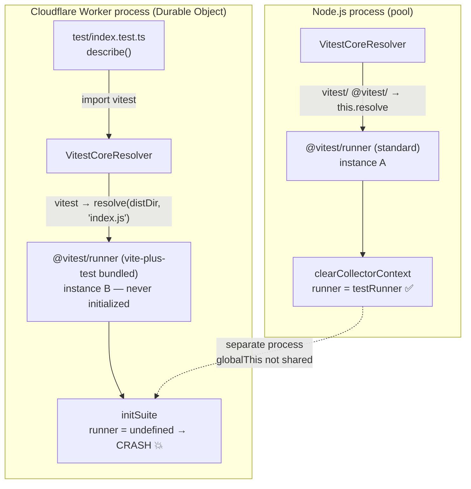

# Reproduction: vite-plus + @cloudflare/vitest-pool-workers crash

Minimal reproduction for [voidzero-dev/vite-plus#1076](https://github.com/voidzero-dev/vite-plus/issues/1076).

## Bug description

When running `vp test` with `@cloudflare/vitest-pool-workers`, any test file that uses `describe()` crashes immediately with:

```
TypeError: Cannot read properties of undefined (reading 'config')
  at initSuite .../vite-plus-test/dist/@vitest/runner/index.js:1203:25
    validateTags(runner.config, suiteTags);
```

Running the same tests with `vitest run` (standard vitest) passes without error.

## Steps to reproduce

```bash
git clone <this-repo>
cd vite-plus-issue-1076
pnpm install
```

### Passes (standard vitest)

```bash
pnpm run test
# vitest run
#  PASS  test/index.test.ts (3 tests)
```

### Fails (vite-plus test)

```bash
vp test
#  FAIL  test/index.test.ts
# TypeError: Cannot read properties of undefined (reading 'config')
#   at initSuite .../vite-plus-test/dist/@vitest/runner/index.js:1203:25
#     validateTags(runner.config, suiteTags);
```

## Root cause

`VitestCoreResolver` in vite-plus intercepts the bare `"vitest"` specifier and redirects it to `vite-plus-test/dist/index.js`. This causes the Cloudflare Worker (Durable Object) to instantiate a separate `@vitest/runner` module from vite-plus-test's bundled copy.

`clearCollectorContext()` is called on the Node.js-side runner instance (setting `runner = testRunner`), but the Worker-side instance never receives this call — it runs in a separate process where `globalThis` is not shared. When the test file's `describe()` calls `initSuite()`, `runner` is still `undefined`.



## Environment

| Package | Version |
|---|---|
| vite-plus | 0.1.13 |
| vitest | 4.1.0 |
| @cloudflare/vitest-pool-workers | 0.13.3 |
| wrangler | 4.76.0 |
| Node.js | >=18 |
